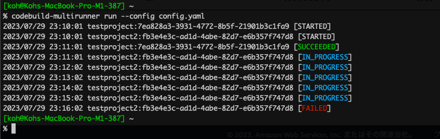

# codebuild-multirunner

## Overview

This is a simple CLI tool to "Start build with overrides" multiple AWS CodeBuild Projects at once.



## Installation

You can install with Homebrew.

```bash
brew install --cask koh-sh/tap/codebuild-multirunner
```

Or download prebuild binary from [Releases](https://github.com/koh-sh/codebuild-multirunner/releases)

## Usage

```bash
This is a simple CLI tool to "Start build with overrides" multiple AWS CodeBuild Projects at once.

This command will read YAML based config file and run multiple CodeBuild projects with oneliner.

Usage:
  codebuild-multirunner [command]

Available Commands:
  completion  Generate the autocompletion script for the specified shell
  dump        dump config for running CodeBuild projects
  help        Help about any command
  log         Print CodeBuild log for a single build with a provided id.
  retry       retry CodeBuild build with a provided id
  run         run CodeBuild projects based on YAML

Flags:
      --config string   file path for config file. (default "./.codebuild-multirunner.yaml")
  -h, --help            help for codebuild-multirunner
  -v, --version         version for codebuild-multirunner

Use "codebuild-multirunner [command] --help" for more information about a command.
```

## QuickStart

### Create Config file

Create YAML based config file.
change "testproject" to your CodeBuild Project name.

```bash
% cat .codebuild-multirunner.yaml
builds:
  - projectName: testproject
```

You can also use a map format to group builds. This allows you to target specific groups for execution using the `--targets` flag.

```yaml
# .codebuild-multirunner.yaml (Map format)
builds:
  group1:
    - projectName: testproject-a
      sourceVersion: main
    - projectName: testproject-b
  group2:
    - projectName: testproject-c
      environmentVariablesOverride:
        - name: STAGE
          value: production
```

### Run

Then execute command with "run" subcommand.

If you are using the legacy list format, all defined projects will be executed:

```bash
codebuild-multirunner run
```

If you are using the new map format, you can run all builds in all groups:

```bash
codebuild-multirunner run
```

Or run only specific groups using the `--targets` flag:

```bash
# Runs only the builds defined under 'group1'
codebuild-multirunner run --targets group1

# Runs builds defined under 'group1' AND 'group2'
codebuild-multirunner run --targets group1 --targets group2
```

**Note:** The `--targets` flag is only available when using the map format for the `builds` section in your configuration file.

If you specify multiple projects (either in the list format or across multiple groups in the map format without targeting), all selected projects will be running at once.

```bash
% cat .codebuild-multirunner.yaml
builds:
  - projectName: testproject
  - projectName: testproject2
  - projectName: testproject3
```

You can "Start build with overrides" by specifying parameters within each build definition:

```bash
% cat .codebuild-multirunner.yaml
builds:
  web-app:
    - projectName: testproject-frontend
    - projectName: testproject-backend
      environmentVariablesOverride:
      - name: TEST_VAR
        value: FOOBAR
        type: PLAINTEXT
  batch-job:
    - projectName: testproject-batch
```

Also environment variables are substituted for execution.

```yaml
builds:
  my-app:
    - projectName: testproject
    - projectName: testproject2
      environmentVariablesOverride:
        - name: TEST_VAR
          value: FOOBAR
          type: PLAINTEXT
    - projectName: testproject3
      sourceVersion: ${BRANCH_NAME} # it will read environment variable
```

You can check the config by "dump" subcommand.

```bash
% export BRANCH_NAME=feature/new_function
% codebuild-multirunner dump
builds:
  my-app:
    - projectName: testproject
    - environmentVariablesOverride:
        - name: TEST_VAR
          type: PLAINTEXT
          value: FOOBAR
      projectName: testproject2
    - projectName: testproject3
      sourceVersion: feature/new_function
%
```

Refer to [sample config file](.codebuild-multirunner.yaml)

### Get build log

And `log` is useful to get detail of a build.

CloudWatch Logs need to be ENABLED for the build.

```bash
% codebuild-multirunner log --id testproject:33719fff-7ee7-4828-9c6a-ec814226e3fc
[Container] 2023/08/11 02:53:03 Waiting for agent ping
[Container] 2023/08/11 02:53:04 Waiting for DOWNLOAD_SOURCE
[Container] 2023/08/11 02:53:05 Phase is DOWNLOAD_SOURCE
[Container] 2023/08/11 02:53:05 CODEBUILD_SRC_DIR=/codebuild/output/src3794654258/src
...
(omitted)
...
[Container] 2023/08/11 02:53:15 Phase context status code:  Message:
[Container] 2023/08/11 02:53:15 Entering phase POST_BUILD
[Container] 2023/08/11 02:53:15 Phase complete: POST_BUILD State: SUCCEEDED
[Container] 2023/08/11 02:53:15 Phase context status code:  Message:
%
```

### Retry past builds

You can retry a past build.

```bash
% codebuild-multirunner retry --id testproject:8948df1b-1352-4f87-bc68-318a37a7949b
2023/08/19 14:52:28 testproject:dd3bd981-59ab-4c78-a0f2-22c75545ffc7 [STARTED]
2023/08/19 14:53:28 testproject:dd3bd981-59ab-4c78-a0f2-22c75545ffc7 [SUCCEEDED]
```

## GitHub Actions

You can use this in GitHub Actions workflow.

```yaml
name: Run Codebuild

on:
  workflow_dispatch:

jobs:
  tag_push:
    runs-on: ubuntu-latest
    steps:
    - uses: actions/checkout@v3
    - name: Configure AWS credentials
      uses: aws-actions/configure-aws-credentials@v1
      with:
        aws-access-key-id: ${{ secrets.AWS_ACCESS_KEY_ID }}
        aws-secret-access-key: ${{ secrets.AWS_SECRET_ACCESS_KEY }}
        aws-region: ap-northeast-1
    - name: run codebuild
      uses: koh-sh/codebuild-multirunner@v0
      with:
        config: '.codebuild-multirunner.yaml'
        polling-span: '60'
```

Definition of input is below.

```yaml
inputs:
   config:
     description: 'file path for config file. (default "./.codebuild-multirunner.yaml")'
     required: false
     default: '.codebuild-multirunner.yaml'
   targets:
     description: 'comma separated list of target group names to run (only used if config is in map format)'
     required: false
     default: ''
   polling-span:
     description: 'polling span in second for builds status check (default 60)'
     required: false
     default: '60'
```
