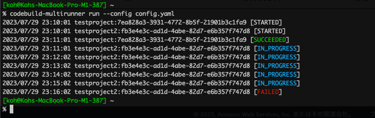

# codebuild-multirunner

## Overview

This is a simple CLI tool to "Start build with overrides" multiple AWS CodeBuild Projects at once.



## Installation

You can install with Homebrew.

```bash
brew install koh-sh/tap/codebuild-multirunner
```

Or download prebuild binary from [Releases](https://github.com/koh-sh/codebuild-multirunner/releases)

## Usage

```bash
This is a simple CLI tool to "Start build with overrides" multiple AWS CodeBuild Projects at once.

This command will read YAML based config file and run multiple CodeBuild projects with oneliner.

Usage:
  codebuild-multirunner [command]

Available Commands:
  completion  Generate the autocompletion script for the specified shell
  dump        dump config for running CodeBuild projects
  help        Help about any command
  run         run CodeBuild projects based on YAML

Flags:
      --config string   file path for config file. (default "./config.yaml")
  -h, --help            help for codebuild-multirunner
  -v, --version         version for codebuild-multirunner

Use "codebuild-multirunner [command] --help" for more information about a command.
```

## QuickStart

### Create Config file

Create YAML based config file.
change "testproject" to your CodeBuild Project name.

```bash
% cat config.yaml
builds:
  - projectName: testproject
```

Then execute command with "run" subcommand, so your CodeBuild project will be running.

```bash
codebuild-multirunner run
```

If you specify multiple projects, all projects will be running at once.

```bash
% cat config.yaml
builds:
  - projectName: testproject
  - projectName: testproject2
  - projectName: testproject3
```

You can "Start build with overrides" by specifying parameters.

```bash
% cat config.yaml
builds:
  - projectName: testproject
  - projectName: testproject2
    environmentVariablesOverride:
    - name: TEST_VAR
      value: FOOBAR
      type: PLAINTEXT
  - projectName: testproject3
```

Also environment variables are substituted for execution.

```bash
builds:
- projectName: testproject
- projectName: testproject2
  environmentVariablesOverride:
    - name: TEST_VAR
      value: FOOBAR
      type: PLAINTEXT
- projectName: testproject3
  sourceVersion: ${BRANCH_NAME} # it will read environment variable
```

You can check the config by "dump" subcommand.

```bash
% export BRANCH_NAME=feature/new_function
% codebuild-multirunner dump
builds:
    - projectName: testproject
    - environmentVariablesOverride:
        - name: TEST_VAR
          type: PLAINTEXT
          value: FOOBAR
      projectName: testproject2
    - projectName: testproject3
      sourceVersion: feature/new_function

%
```

Refer to [sample config file](config.yaml)
